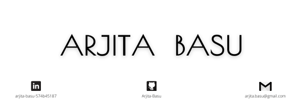

<h1 align="center">Hi 👋, I'm Arjita Basu</h1>
<h3 align="center">A passionate penultimate year student pursuing Integrated Masters in Mathematics and Computing from Birla Institute of Technology, Mesra,India</h3>

- 👯 I’m looking to collaborate with **other knowledge hungry and learned individuals.**

- 😏 I'm fluent in **Data Analysis.**

- 🌱 I’m currently learning **Machine Learning** 

- 📫 How to reach me **https://www.linkedin.com/in/arjita-basu-574b45187/**

- ⚡ Fun fact **I am good at everything but perfect in none.**

<h3 align="left">Languages and Tools:</h3>

     

